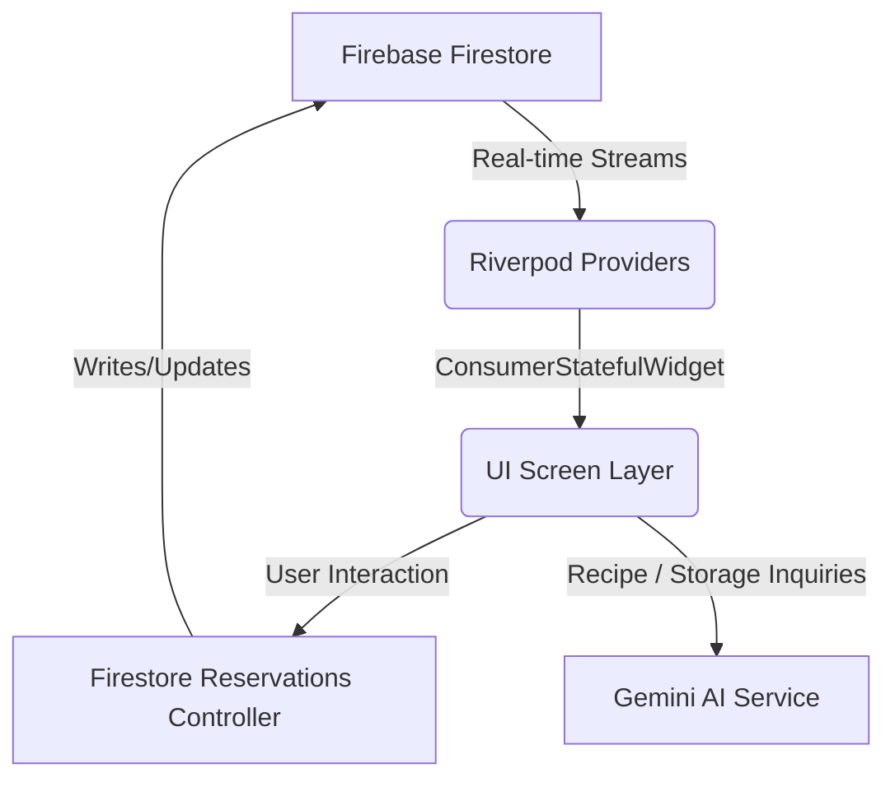

# FoodRescue App Reference & Interview Guide

This guide describes the architecture, codebase organization, styling assets, and key technical concepts of the **FoodRescue** application. It serves as a study guide for academic submissions and project presentations.

---

## 🏗️ Core Architecture & Codebase Design

The project uses a structured, modular design with **Riverpod** for state management and **Firebase Firestore** for real-time streams.

### 📁 Directory Layout
- [`lib/constants/`](file:///c:/Users/thisi/OneDrive/Documents/GitHub/foodrescue_labgh/lib/constants): Defines visual theme specifications ([`app_theme.dart`](file:///c:/Users/thisi/OneDrive/Documents/GitHub/foodrescue_labgh/lib/constants/app_theme.dart)) and color systems ([`app_colors.dart`](file:///c:/Users/thisi/OneDrive/Documents/GitHub/foodrescue_labgh/lib/constants/app_colors.dart)).
- [`lib/models/`](file:///c:/Users/thisi/OneDrive/Documents/GitHub/foodrescue_labgh/lib/models): Contains Firestore serialization schemas (`user_model.dart`, `listing_model.dart`, `reservation_model.dart`).
- [`lib/providers/`](file:///c:/Users/thisi/OneDrive/Documents/GitHub/foodrescue_labgh/lib/providers): Holds Riverpod state definitions (`database_providers.dart`, `providers.dart`).
- [`lib/screens/`](file:///c:/Users/thisi/OneDrive/Documents/GitHub/foodrescue_labgh/lib/screens): Contains all view controllers and layout structures:
  - [`home_screen.dart`](file:///c:/Users/thisi/OneDrive/Documents/GitHub/foodrescue_labgh/lib/screens/home_screen.dart): Marketplace layout, carousels, and community impact summaries.
  - [`discovery_map_screen.dart`](file:///c:/Users/thisi/OneDrive/Documents/GitHub/foodrescue_labgh/lib/screens/discovery_map_screen.dart): Interactive map displaying pin avatars with lower triangle pointers and toggling category chips.
  - [`item_details_screen.dart`](file:///c:/Users/thisi/OneDrive/Documents/GitHub/foodrescue_labgh/lib/screens/item_details_screen.dart): Photo carousel, freshness badges, stock indicators, and cupertino-wheel booking sheets.
  - [`reservation_confirmation_screen.dart`](file:///c:/Users/thisi/OneDrive/Documents/GitHub/foodrescue_labgh/lib/screens/reservation_confirmation_screen.dart): Restructured details summary card, barcode NETS QR code preview, and directions buttons.
  - [`reservation_details_screen.dart`](file:///c:/Users/thisi/OneDrive/Documents/GitHub/foodrescue_labgh/lib/screens/reservation_details_screen.dart): Ticket status banner, order grid, claimed status visual override, and update sheets.
  - [`impact_dashboard_screen.dart`](file:///c:/Users/thisi/OneDrive/Documents/GitHub/foodrescue_labgh/lib/screens/impact_dashboard_screen.dart): Bento stats grid with circular progress gauges, footprint offsets, savings chart, and Gemini Eco-assistant console.
  - [`profile_screen.dart`](file:///c:/Users/thisi/OneDrive/Documents/GitHub/foodrescue_labgh/lib/screens/profile_screen.dart): Seeder actions, profile edits, past rescues history, and Auth signout hooks.

---

## 🎨 Design System & Fonts Setup

To adhere to premium UI/UX guidelines, default styling values have been overridden with custom Google Fonts and calibrated colors:

### 1. Typography & Custom Fonts
Registered inside [`pubspec.yaml`](file:///c:/Users/thisi/OneDrive/Documents/GitHub/foodrescue_labgh/pubspec.yaml):
- **Epilogue**: Used for headlines, titles, and dashboard gauges.
  - Bold: `Epilogue-Bold.ttf`
  - Regular: `Epilogue-Regular.ttf`
- **Work Sans**: Used for body copy, settings, and form labels.
  - Bold: `WorkSans-Bold.ttf`
  - Semi-Bold: `WorkSans-SemiBold.ttf`
  - Regular: `WorkSans-Regular.ttf`

### 2. Colors System ([`app_colors.dart`](file:///c:/Users/thisi/OneDrive/Documents/GitHub/foodrescue_labgh/lib/constants/app_colors.dart))
- **Primary**: Cyber-Yellow (`0xFFFFD300`) — high-visibility brand color.
- **Accent**: Accent Orange (`0xFFFF5A00`) — used for alerts, remaining portions, and important warnings.
- **Impact Green**: Eco-Forest Green (`0xFF008080`) — represents positive sustainability impacts.

---

## 💬 Interview & Presentation Q&A Study Guide

Below are curated technical questions and answers designed for academic reviews:

### Q1: Why did you choose Riverpod over standard setState or Provider?
> **Answer**: Riverpod is a robust compile-safe reactive state solution for Flutter. Unlike `setState` (which couples state to a single widget), Riverpod allows global access to Firestore streams. Unlike the legacy `Provider` package, Riverpod does not depend on the Flutter `BuildContext` to read states, which allows us to write decoupling repository utilities and run calculations outside of the widget tree (e.g. inside seeder services).

### Q2: How does the real-time stream sync work?
> **Answer**: We bind Riverpod providers (e.g., `listingsStreamProvider` and `userProfileStreamProvider`) to Firestore streams. When a user completes a claim or updates a portion count, the backend database modifies the record. Firestore automatically pushes this change down to our Riverpod streams. The UI, which watches these providers via `ref.watch()`, immediately rebuilds to display the updated data without needing a page refresh.

### Q3: How is the Gemini Eco-Assistant integrated and optimized?
> **Answer**: The app implements a `GeminiService` that utilizes Google's generative AI models. We pass the user's active/past reservations as system instructions alongside the user's text query. This provides personalized advice (e.g. recipes based on the exact item they reserved) rather than generic responses. We also optimized the input fields to override double-nested backgrounds by setting `filled: false` in local `InputDecorations`.

### Q4: How does the NETS QR Code simulation fit the grading rubrics?
> **Answer**: The project specification requires a contactless payment integration for item rescue verification. The confirmation and details screens generate a payment QR code incorporating the custom `reservationId` and `totalPaid` values. When scanned at the merchant counter, the merchant's terminal updates the Firestore record's status from `active` to `past`, instantly reflecting meals and weight saved on the user's **Impact Dashboard** in real time.

---
